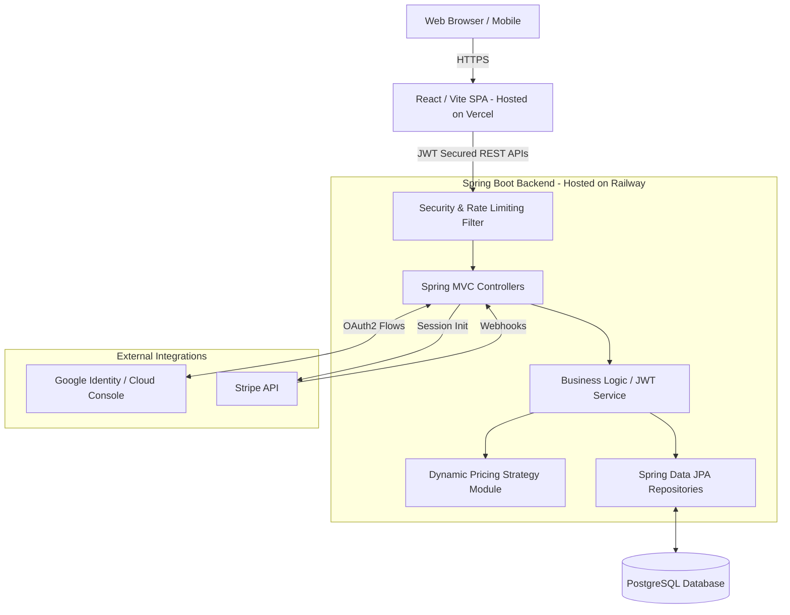

# 🏨 StaySoul - Premium Hotel Booking Platform

<p align="center">
  
  
  
  
  
  
  
  
</p>

> A comprehensive, full-stack hotel management and booking system inspired by Airbnb. Features dynamic pricing, secure authentication (JWT & Google OAuth), interactive mapping, and seamless Stripe payments.

---

## 📖 About the Project

StaySoul is a robust, production-ready platform designed to facilitate seamless property management and booking operations. The platform enables hotel owners to list their properties, manage rooms, and track inventory in real-time, leveraging AI-driven dynamic pricing strategies to maximize revenue. Guests can interact with visually rich property listings, utilize geographic map-based searches, safely authenticate via Google or Email, and seamlessly book rooms through Stripe checkout. 

This project demonstrates how modern tech stacks (React single-page applications) and enterprise-grade backends (Spring Boot) can be harmonized to create a secure, scalable, and stunning real-world application.

---

## ✨ Features

| Feature | Description |
|---------|-------------|
| 🗺️ **Interactive Maps** | Dynamic property discovery using Leaflet maps with zoom handling |
| 🔐 **Hybrid Auth** | Secure JWT token based auth alongside Google OAuth2 Integration |
| 💰 **Dynamic Pricing** | AI-driven backend pricing using the Strategy Pattern (Surge, Holiday, Urgency) |
| 💳 **Stripe Payments** | Integrated Stripe checkout sessions and asynchronous Webhook fulfillments |
| 🏨 **Property Handling** | End-to-end admin capabilities for managing hotels, rooms, and localized INR formatting |
| 📈 **API Protection** | Configured rate-limiting heavily utilizing Bucket4j against abuse |
| 🚀 **Deploy Ready** | Production environment configurations (CORS, hidden stack-traces, strict routing) |

---

## 🏗️ System Design & Architecture

StaySoul is split into a decoupled frontend and backend that communicate securely over REST APIs.



### Backend Design Patterns

| Pattern | Implementation Use-Case |
|---------|-------------------------|
| 🎯 **Strategy Pattern** | Dynamic Pricing logic to adapt costs immediately based on external factors. |
| 🏗️ **MVC Pattern** | Clear abstraction between Controllers, Services, and Repositories. |
| 🔄 **DTO Pattern** | Using ModelMapper to translate deep Entity relationships back to safe Frontend data. |

---

## 🛠️ Tech Stack

### Frontend Application
- **Framework**: React 18 / Vite
- **Styling**: TailwindCSS
- **Routing**: React Router DOM (with Route Guards)
- **Mapping**: Leaflet / React-Leaflet
- **HTTP Client**: Axios with Axios Interceptors
- **State & Icons**: Context API & Lucide React

### Backend Services
- **Framework**: Spring Boot 3.2+
- **Language**: Java 21
- **Database**: PostgreSQL
- **Security**: Spring Security + JWT
- **Integrations**: Stripe API (Payments), Google OAuth2 (Auth), Spring Mail (SMTP)
- **Documentation**: SpringDoc OpenAPI (Swagger UI)
- **Rate Limiting**: Bucket4j

---

## 🚀 Deployment (Production Ready)

StaySoul is structured for instant PaaS deployments using platforms like Vercel and Railway:

1. **Frontend (Vercel)**:
   - Command: `npm run build`
   - Output Dir: `dist`
   - Env Var: `VITE_API_BASE_URL=https://your-backend-railway-app.up.railway.app/api/v1`

2. **Backend (Railway)**:
   - Uses `Procfile` and `railway.json` for Maven generation.
   - Command: `java -Dserver.port=$PORT -jar target/StaySoul-0.0.1-SNAPSHOT.jar`
   - Auto-provisioned PostgreSQL plugin connection.

### Production Environment Variables

Ensure the following variables are strictly sequestered from version control during deployment:
- `DB_URL`, `DB_USERNAME`, `DB_PASSWORD`
- `JWT_SECRET_KEY` (min. 32 characters securely generated)
- `FRONTEND_URL` (for strict CORS policy)
- `STRIPE_SECRET_KEY` & `STRIPE_WEBHOOK_SECRET`
- `GOOGLE_CLIENT_ID` & `GOOGLE_CLIENT_SECRET`

---

## 💻 Local Development

### Prerequisites
- Node.js 18+
- Java JDK 21+
- PostgreSQL 14+
- Maven 3.8+

### Database Setup
```sql
CREATE DATABASE staysoul;
```

### Running Backend
Modify `src/main/resources/application.properties` with your PostgreSQL credentials.
```bash
./mvnw clean install
./mvnw spring-boot:run
```
*API available at `http://localhost:8080/api/v1`* <br>
*Swagger UI at `http://localhost:8080/api/v1/swagger-ui.html`*

### Running Frontend
From the `frontend/` directory, duplicate `.env.production` to a `.env` file and set `VITE_API_BASE_URL` to `http://localhost:8080/api/v1`.
```bash
cd frontend
npm install
npm run dev
```

---

## 🤝 Contributing & License

Contributions are welcome! Please follow basic coding standards (Java naming conventions, well-formatted React code), and create pull requests for any significant updates.

This project is licensed under the **MIT License** - see the `LICENSE` file for details.

<p align="center">
  Made with ❤️ by <a href="https://github.com/nims-creation">Nitesh Mishra</a>
</p>
