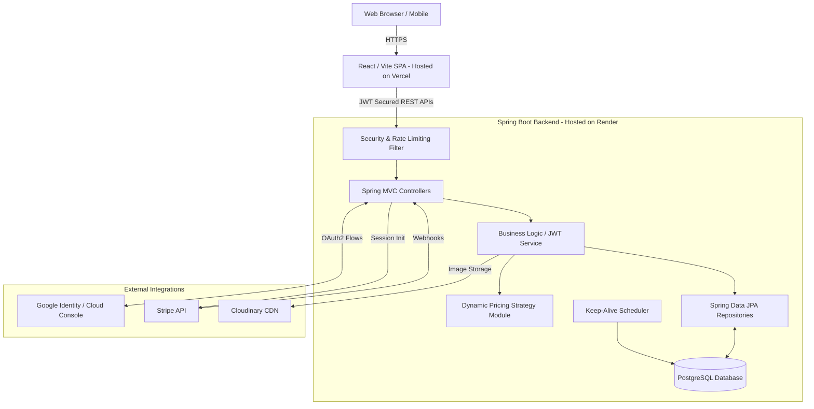

# 🏨 StaySoul - Premium Hotel Booking Platform

<p align="center">
  
  
  
  
  
  
  
  
  
  
</p>

> A comprehensive, full-stack hotel management and booking system inspired by Airbnb. Features dynamic pricing, secure authentication (JWT & Google OAuth), interactive mapping, premium UI animations, and seamless Stripe payments.

---

## 🌐 Live Demo

| Service | URL |
|---------|-----|
| 🖥️ **Frontend (Vercel)** | [https://stay-soul.vercel.app](https://stay-soul.vercel.app) |
| ⚙️ **Backend API (Render)** | [https://staysoul-api.onrender.com/api/v1](https://staysoul-api.onrender.com/api/v1) |
| 📚 **Swagger / API Docs** | [https://staysoul-api.onrender.com/api/v1/swagger-ui.html](https://staysoul-api.onrender.com/api/v1/swagger-ui.html) |

> **Note:** The backend is hosted on Render's free tier and may take ~30 seconds to wake up on first request. Please wait and refresh if the page shows demo data.

---

## 📖 About the Project

StaySoul is a robust, production-ready hotel booking platform designed to facilitate seamless property management and booking operations. The platform enables hotel owners to list their properties with real photos (via Cloudinary), manage rooms, and track inventory in real-time — leveraging AI-driven dynamic pricing strategies to maximize revenue.

Guests can discover visually rich property listings, use geographic map-based searches, safely authenticate via Google or Email, and seamlessly book rooms through Stripe checkout. The frontend features premium glassmorphic design, smooth Framer Motion animations, skeleton loaders, and a fully responsive layout.

---

## ✨ Features

| Feature | Description |
|---------|-------------|
| 🗺️ **Interactive Maps** | Dynamic property discovery using Leaflet maps with zoom handling |
| 🔐 **Hybrid Auth** | Secure JWT token based auth alongside Google OAuth2 Integration |
| 💰 **Dynamic Pricing** | AI-driven backend pricing using the Strategy Pattern (Surge, Holiday, Urgency) |
| 💳 **Stripe Payments** | Integrated Stripe checkout sessions and asynchronous Webhook fulfillments |
| 🏨 **Property Management** | End-to-end admin capabilities: create, edit, activate, and delete hotel listings |
| 🖼️ **Cloud Image Uploads** | Drag & drop image uploading via Cloudinary with live preview grid |
| 🎨 **Premium UI/UX** | Glassmorphic navbar, Framer Motion staggered animations, skeleton loaders |
| 📈 **API Protection** | Rate-limiting heavily utilizing Bucket4j against abuse |
| 🔄 **Server-side Pagination** | Efficient hotel search backed by native optimized PostgreSQL queries |
| 🚀 **Deploy Ready** | Production environment configurations with keep-alive scheduler for Render |

---

## 🏗️ System Design & Architecture

StaySoul is split into a decoupled frontend and backend that communicate securely over REST APIs.



### Backend Design Patterns

| Pattern | Implementation Use-Case |
|---------|-------------------------|
| 🎯 **Strategy Pattern** | Dynamic Pricing logic to adapt costs based on surge/urgency/holiday factors |
| 🏗️ **MVC Pattern** | Clear abstraction between Controllers, Services, and Repositories |
| 🔄 **DTO Pattern** | Using ModelMapper to translate deep Entity relationships to safe Frontend data |
| 🛡️ **Soft Delete** | `@SQLDelete` + `@SQLRestriction` for safe, reversible hotel/room deletion |

---

## 🛠️ Tech Stack

### Frontend Application
- **Framework**: React 18 / Vite 5
- **Styling**: TailwindCSS 3
- **Animations**: Framer Motion (staggered grids, skeleton loaders)
- **Routing**: React Router DOM v6 (with Route Guards)
- **Mapping**: Leaflet / React-Leaflet
- **HTTP Client**: Axios with interceptors (auth tokens + response unwrapping)
- **Image Uploads**: Cloudinary Direct Upload (unsigned preset)
- **State & Icons**: Context API & Lucide React

### Backend Services
- **Framework**: Spring Boot 4.0
- **Language**: Java 21
- **Database**: PostgreSQL 16
- **ORM**: Spring Data JPA / Hibernate (with soft-delete, `@SQLRestriction`)
- **Connection Pool**: HikariCP (cloud-tuned keep-alive config)
- **Security**: Spring Security + JWT + Google OAuth2
- **Cache**: Spring Cache (`@Cacheable` on hotel searches)
- **Integrations**: Stripe API, Google OAuth2, Spring Mail (SMTP), Cloudinary
- **Documentation**: SpringDoc OpenAPI 3 (Swagger UI)
- **Rate Limiting**: Bucket4j

---

## 🚀 Deployment (Production)

| Component | Platform | URL |
|-----------|----------|-----|
| Frontend | **Vercel** | https://stay-soul.vercel.app |
| Backend | **Render** | https://staysoul-api.onrender.com |
| Database | **Render PostgreSQL** | (internal) |

### Frontend — Vercel Setup
- **Build Command**: `npm run build`
- **Output Dir**: `dist`
- **Environment Variable**: `VITE_API_BASE_URL=https://staysoul-api.onrender.com/api/v1`

### Backend — Render Setup
- **Build Command**: `./mvnw clean package -DskipTests`
- **Start Command**: `java -Dserver.port=$PORT -jar target/StaySoul-0.0.1-SNAPSHOT.jar`
- **Environment**: PostgreSQL add-on attached

### Required Environment Variables (Backend)

| Variable | Description |
|----------|-------------|
| `DB_URL` | PostgreSQL JDBC URL |
| `DB_USERNAME` | Database user |
| `DB_PASSWORD` | Database password |
| `JWT_SECRET_KEY` | Min. 32-character secret for JWT signing |
| `FRONTEND_URL` | Vercel frontend URL (for CORS) |
| `STRIPE_SECRET_KEY` | Stripe secret key |
| `STRIPE_WEBHOOK_SECRET` | Stripe webhook signing secret |
| `GOOGLE_CLIENT_ID` | Google OAuth2 client ID |
| `GOOGLE_CLIENT_SECRET` | Google OAuth2 client secret |
| `EMAIL_USERNAME` | Gmail SMTP username |
| `EMAIL_PASSWORD` | Gmail app password |

---

## 💻 Local Development

### Prerequisites
- Node.js 18+
- Java JDK 21+
- PostgreSQL 16+
- Maven 3.8+

### Database Setup
```sql
CREATE DATABASE "StaySoul";
```

### Running Backend
Modify `src/main/resources/application.properties` with your local PostgreSQL credentials.
```bash
./mvnw clean install
./mvnw spring-boot:run
```
- API available at: `http://localhost:8080/api/v1`
- **Swagger UI at: `http://localhost:8080/api/v1/swagger-ui.html`**

### Running Frontend
```bash
cd frontend
npm install
npm run dev
```
Create a `.env` file in `frontend/` with:
```env
VITE_API_BASE_URL=http://localhost:8080/api/v1
```

### Default Admin Credentials (seeded on startup)
| Email | Password |
|-------|----------|
| `admin@gmail.com` | `password` |
| `admin2@gmail.com` | `password` |

---

## 🖼️ Image Uploads (Cloudinary)

Property photos are uploaded directly from the browser to Cloudinary using the **unsigned `ml_default` preset** (auto-created with every Cloudinary account). No server-side code is needed for uploads.

- **Cloud Name**: `dv4a3qyrt` (configured in `ImageUpload.jsx`)
- **Upload Preset**: `ml_default` (unsigned, browser-direct)

---

## 🤝 Contributing & License

Contributions are welcome! Please follow basic coding standards (Java naming conventions, well-formatted React code), and create pull requests for any significant updates.

This project is licensed under the **MIT License** — see the `LICENSE` file for details.

<p align="center">
  Made with ❤️ by <a href="https://github.com/nims-creation">Nitesh Mishra</a>
</p>
